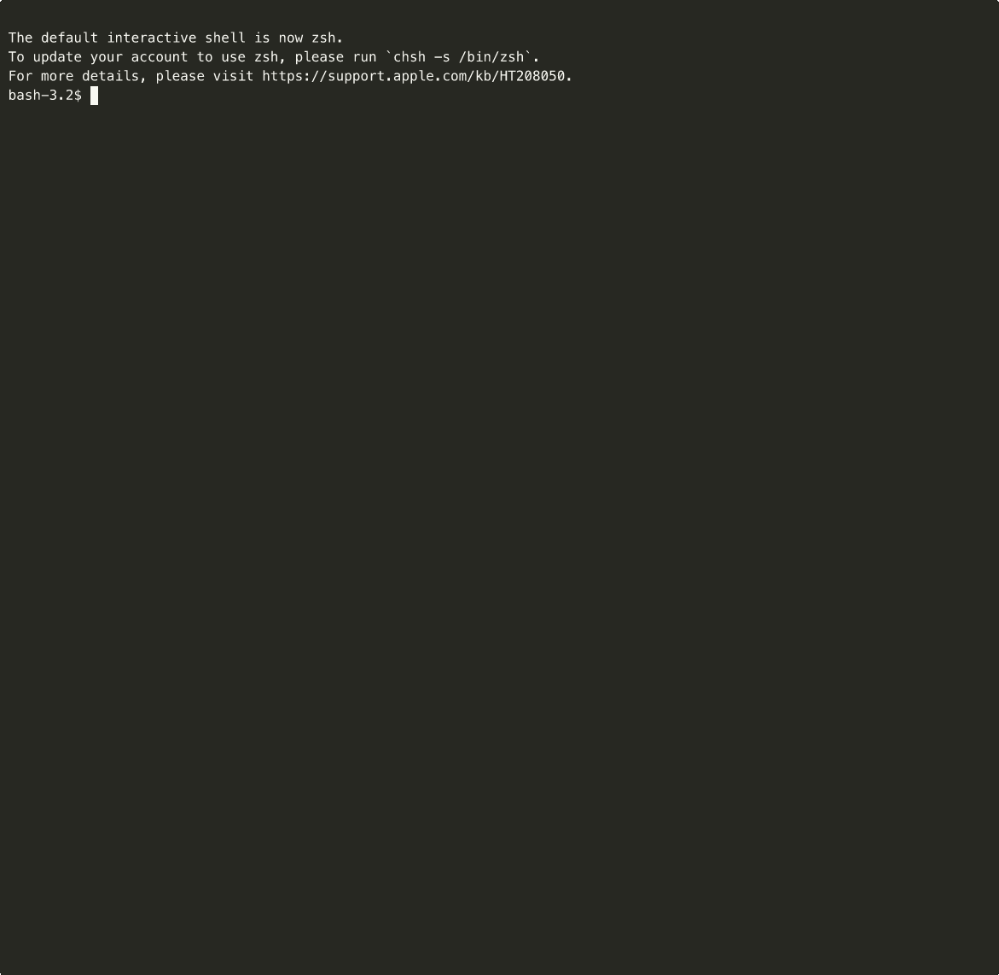

# kli

[](https://github.com/siqiliu18/kli/actions/workflows/ci.yml)

A developer-friendly Kubernetes CLI with clean, readable output.

```
kli apply -f ./manifests -n staging
kli status -n staging
kli logs my-pod --grep ERROR -f
kli undeploy -f ./manifests -n staging
```



---

## Why kli?

`kubectl` output is dense. `kli` shows you what changed, what's healthy, and what's broken — at a glance.

| | kubectl | kli |
|---|---|---|
| Apply | `configured` for every resource | ✅ created / 🔄 configured / ⚡ unchanged per resource |
| Status | Multi-command (get deploy, get pods) | Single command with health state + pod list |
| Logs | Plain text | Color-coded ERROR / WARN lines |
| Undeploy | Silent or verbose | Per-resource result with finalizer warnings |

---

## Installation

**Build from source** (requires Go 1.21+):

```bash
git clone https://github.com/siqiliu18/kli.git
cd kli
go build -o kli .
sudo mv kli /usr/local/bin/
```

**Prerequisites:** A valid `~/.kube/config` (same as `kubectl`). Respects the `KUBECONFIG` environment variable.

---

## Commands

### `kli apply`

Apply resources from a file or folder. Uses server-side apply — safe to run repeatedly.

```bash
kli apply -f deployment.yaml -n default
kli apply -f ./manifests/ -n staging
kli apply -f deployment.yaml -n default --dry-run
```

Output:
```
  ✅  Deployment/nginx                       created
  🔄  ConfigMap/app-config                   configured
  ⚡   Service/nginx                          unchanged

Applied 3 resources — ✅ 1 created  🔄 1 configured  ⚡ 1 unchanged  ❌ 0 failed
```

### `kli undeploy`

Delete resources defined in a file or folder. Skips resources that don't exist. Warns if finalizers are blocking deletion.

```bash
kli undeploy -f deployment.yaml -n default
kli undeploy -f ./manifests/ -n staging
```

Output:
```
  🗑️  Deployment/nginx                       deleted
  ⚡   Service/api                            skipped (not found)

Undeployed 2 resources — 🗑️ 1 deleted  ⚡ 1 skipped  ⚠️ 0 warned  ❌ 0 failed
```

### `kli status`

Show health and pod status for all Deployments, StatefulSets, and DaemonSets in a namespace.

```bash
kli status -n staging
```

Output:
```
Namespace: staging

DEPLOYMENTS
  ✅  nginx                       2/2   Healthy
      nginx-6d4cf56db6-abc12            Running
      nginx-6d4cf56db6-def34            Running
  ⚠️  frontend                    1/3   Degraded
      frontend-7b9f8d-ghi56             Running
      frontend-7b9f8d-jkl78             Pending
      frontend-7b9f8d-mno90             ImagePullBackOff
          → kubectl describe pod frontend-7b9f8d-mno90
```

### `kli logs`

Stream pod logs with color-coded output. Client-side grep filtering.

```bash
kli logs my-pod -n default
kli logs my-pod -n default --follow
kli logs my-pod -n default --grep ERROR
kli logs my-pod -n default -c sidecar
```

Flags:
- `--follow / -f` — stream continuously
- `--grep` — filter lines by substring (client-side)
- `--container / -c` — select container in multi-container pods

---

## Global Flags

| Flag | Short | Default | Description |
|---|---|---|---|
| `--namespace` | `-n` | `default` | Kubernetes namespace |

---

## Architecture

```
cmd/          CLI commands (cobra) — flag parsing, spinner, output
internal/
  k8s/        Kubernetes operations — apply, undeploy, status, logs
  ui/          Terminal rendering — tables, colors, spinner
  types/       Shared types — ResourceResult, ResourceStatus, HealthState
```

- **`k8s/apply`** and **`k8s/undeploy`** use the dynamic client for arbitrary YAML and CRD support
- **`k8s/status`** and **`k8s/logs`** use the typed client for structured access and log streaming
- `internal/types` exists to avoid circular imports between `k8s` and `ui`

---

## Development

```bash
make build         # go build -o kli .
go test ./...      # run unit tests
make test-apply    # manual integration test against current cluster
make test-status   # kli status -n kli1
```
